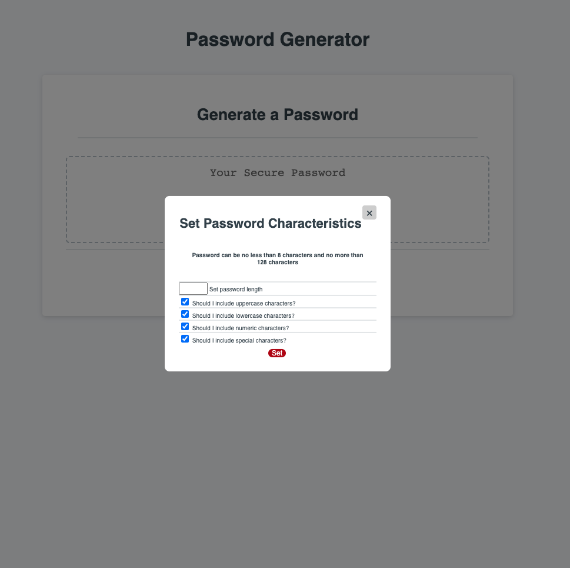
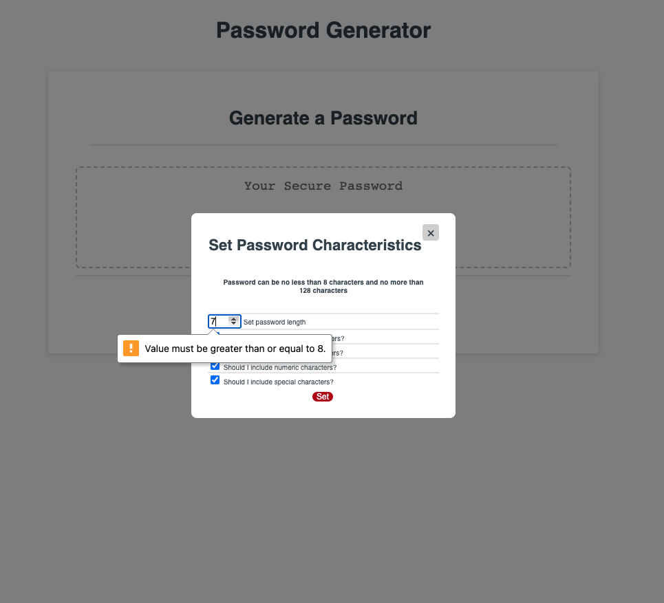
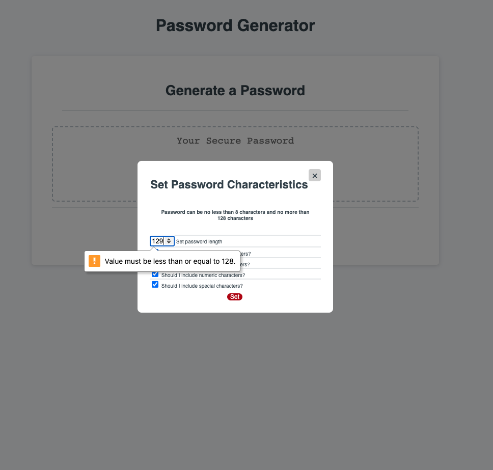

# week3-challenge
Week 3 Homework Challenge - Password Generator
Completed Week 3 Homework Challenge to build Password Generator by
1. Ensuring code base has good accessibility and enhancing to provide new functionality
2. Streamlining CSS stylesheet and enhancing to provide new functionality
3. Updating JavaScript to provide Password Generator functionality with comments and console logs that can be easily followed

## User Story
AS AN employee with access to sensitive data
I WANT to randomly generate a password that meets certain criteria
SO THAT I can create a strong password that provides greater security

## Acceptance Criteria
GIVEN I need a new, secure password
WHEN I click the button to generate a password
THEN I am presented with a series of prompts for password criteria
WHEN prompted for password criteria
THEN I select which criteria to include in the password
WHEN prompted for the length of the password
THEN I choose a length of at least 8 characters and no more than 128 characters
WHEN asked for character types to include in the password
THEN I confirm whether or not to include lowercase, uppercase, numeric, and/or special characters
WHEN I answer each prompt
THEN my input should be validated and at least one character type should be selected
WHEN all prompts are answered
THEN a password is generated that matches the selected criteria
WHEN the password is generated
THEN the password is either displayed in an alert or written to the page

## Mock-up
The following images show the web application's appearance and functionality:

## Deployed Application Link
https://jae-as.github.io/week3-challenge/